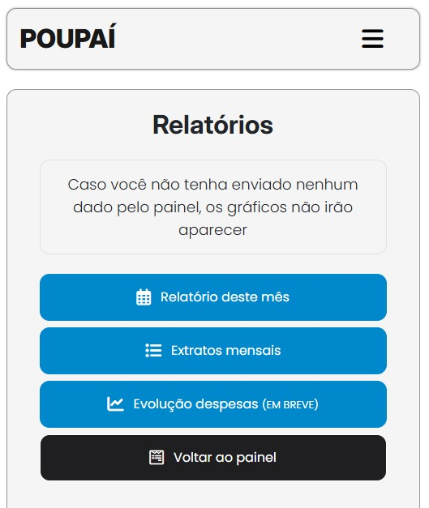

  <h1>POUPAÍ é um site de gerenciamento de finanças pessoais</h1>  

  

 

  <h2>Detalhes:</h2>

  <strong>Status</strong>: Em desenvolvimento  
  <strong>Tempo em desenvolvimento</strong>: Aproximadamente 1 mês, contando desde a prototipagem.   

  <h2>O que foi utilizado no projeto:</h2>

<ul>
  <li>Figma (prototipagem)</li>
  <li>HTML</li>
  <li>CSS</li>
  <li>Bootstrap</li>
  <li>PHP</li>
  <li>Javascript</li>
  <li>Charts.js</li>
  <li>MySQL</li>
  <li>SQL</li>
</ul>

  <h2>O que o sistema faz:</h2>

<ul>
  <li>CRUD para usuários, movimentações e extratos mensais</li>
  <li>Retorna gráficos de pizza sobre as despesas e receitas do usuário naquele mês</li>
  <li>Na virada de cada mês o sistema salva um extrato do mês anterior que será exibido logo abaixo dos relatórios, para que o usuário possa ter um histórico de sua vida financeira</li>
  <li>A assistente Eliza dá feedbacks sobre a relação despesa x receita do usuário com a finalidade de garantir um vida financeira saudável</li>
</ul>

  <h2>Melhorias:</h2>

<ul>
  <li>Aprender e implementar prepared statement para diminuir a possibilidade de SQL Injection</li>
  <li>Adicionar relatório anual com detalhes sobre cada categoria de despesa ao passar dos meses</li>
</ul>

  <h2>O que aprendi com este projeto:</h2>

<ul>
  <li><strong>Fazer um sistema rodar fora do meu localhost</strong></li>
  <li>Deixar o meu sistema modular utilizando arquivos exclusivos para funções e incluindo apenas os chamados nas páginas</li>
  <li>Lidar com sessões de usuário e criptografia de senha no banco de dados</li>
  <li>Utilizar cookie com tempo de expiração para o usuário não ter que logar toda vez que abre o site</li>
  <li>Utilizar SQL para realizar consultas mais complexas</li>
  <li>Utilizar charts.js para exibir gráficos</li>
  <li>Utilizar JSON para enviar dados de uma consulta ao db para o Javascript</li>
</ul>

  <h2>Gráficos de pizza sobre as despesas e receitas do usuário naquele mês</h2>  

  

  <h2>Relatórios da assistente Eliza (não é IA, apenas uma sacada de UX)</h2>  

  

  <h2>Navegação otimizada para mobile</h2>  

  

